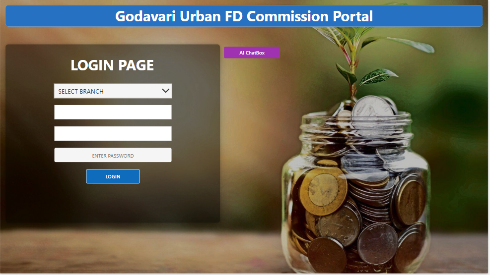
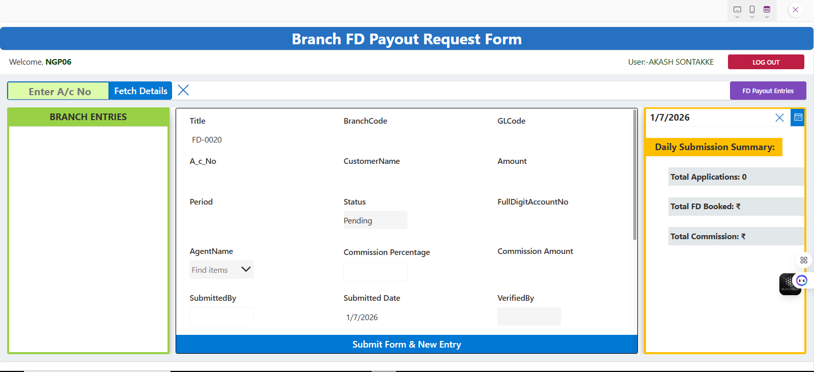

# FD Commission Power App

## Overview
This project is a Power Apps Canvas App designed for managing
FD Commission & Payout requests at branch level with approval workflow.

> ⚠️ Note: This app is shared for **learning & portfolio purposes only**.
> Organization-specific data and credentials are removed.

## Features
- Branch-based login
- FD payout request entry
- Commission calculation
- Daily submission summary
- Role-based visibility
- Power Automate approval workflow

## Tech Stack
- Power Apps (Canvas App)
- SharePoint Online
- Power Automate
- Power Fx

## Screenshots

## How to Use
1. Import `.msapp` into Power Apps
2. Recreate SharePoint lists using schema
3. Import Power Automate flows
4. Update data source connections

## Disclaimer
This repository does **not** contain live organizational data.
All names and branding are used for reference only.
